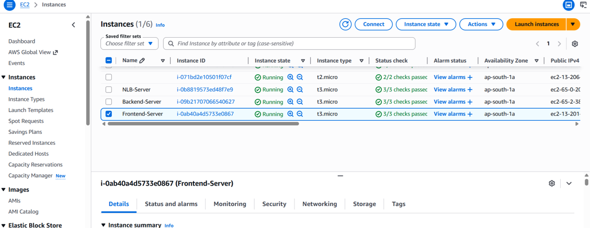

 # 🚀 Multi-tier Web App Deployment
            
## 📌 Overview
This project demonstrates a multi-tier web application deployment on AWS using separate frontend, backend, and database layers. The architecture improves scalability, security, maintainability, and performance by isolating application components into different tiers.

---   

## 🎯 Purpose
To deploy a scalable and secure multi-tier architecture by separating the application into:

- Frontend Layer
- Backend Layer
- Database Layer

---

## 🧰 AWS Services Used
- Amazon EC2
- Amazon RDS
- Application Load Balancer (ALB)
- Target Group
- Security Groups
- Amazon VPC

---

# ⚙️ Architecture Workflow

```text
User Request
      │
      ▼
Application Load Balancer
      │
      ▼
Frontend EC2 Server
      │
      ▼
Backend EC2 Server
      │
      ▼
Amazon RDS Database
```

---

# 📌 Project Overview
This project demonstrates a multi-tier architecture where frontend, backend, and database components are deployed separately for better scalability, security, and fault isolation.

---

# 🚀 Features
- Layered Architecture
- High Availability
- Better Security
- Scalable Deployment
- Traffic Distribution using Load Balancer
- Database Isolation using Amazon RDS

---

# 🔄 How It Works

1. User accesses the application through Load Balancer  
2. Request is forwarded to Frontend EC2 Server  
3. Frontend communicates with Backend Server  
4. Backend processes data and interacts with Amazon RDS  
5. Database returns required information back to the application  

---

# 🛠️ Step-by-Step Setup

## 1️⃣ Launch Frontend EC2 Instance
- Install frontend application
- Configure web server

Example:

```bash
sudo yum install httpd -y
sudo systemctl start httpd
sudo systemctl enable httpd
```

---

## 2️⃣ Launch Backend EC2 Instance
- Install backend dependencies
- Configure backend APIs
- Connect backend to RDS database

---

## 3️⃣ Create Amazon RDS Database
- Create MySQL/PostgreSQL database
- Configure database security group
- Allow backend server access

---

## 4️⃣ Configure Security Groups

### Frontend Security Group
Allow:
- HTTP (Port 80)
- HTTPS (Port 443)

### Backend Security Group
Allow:
- Backend API Port
- SSH Access

### Database Security Group
Allow:
- MySQL/PostgreSQL access only from Backend Server

---

## 5️⃣ Create Target Group
- Register frontend EC2 instance
- Configure health checks

---

## 6️⃣ Create Application Load Balancer
- Create Internet-facing ALB
- Attach Target Group
- Configure listeners

---

## 7️⃣ Test the Application
Open the ALB DNS URL in browser:

```text
http://your-load-balancer-dns
```

---

# 📸 Project Screenshots

## 🌐 Frontend Server


---

## 🔄 Frontend Calling Backend


---

## ⚙️ Backend Server


---

## 💻 Backend Commands


---

## 🗄️ Database Setup


---

## 🖥️ EC2 Instances


---

## ⚖️ Load Balancer


---

## 🛢️ RDS Database


---

## 🎯 Target Group


---

# 💡 Key Features
- Three-tier Architecture
- Improved Security
- Scalable Infrastructure
- Traffic Load Distribution
- Database Isolation
- High Availability

---

# 🧠 Learning Outcomes
- Understanding Multi-tier Architecture
- Deploying Frontend and Backend Servers
- Configuring Amazon RDS
- Working with Load Balancers
- Managing AWS Networking and Security

---

# 🔮 Future Improvements
- Add Auto Scaling
- Configure HTTPS using ACM
- Add CloudWatch Monitoring
- Integrate Route 53 Domain
- Deploy using Terraform

---

# 👩‍💻 Author
**Nitisha Mali**

GitHub: [Nitisha-hub](https://github.com/Nitisha-hub)
